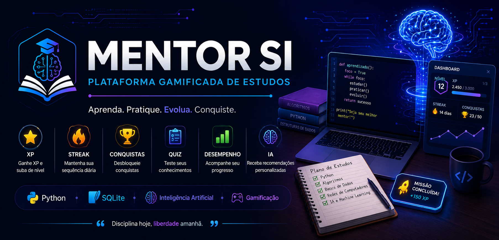

# 🎓 Mentor SI 

<p align="center">
  
</p>

<p align="center">
Plataforma gamificada para o aprendizado de programação, desenvolvida em Python com IA e SQLite.
</p>


## 📚 Sobre o projeto

O Mentor SI é uma plataforma gamificada desenvolvida em Python para auxiliar estudantes de Sistemas de Informação no aprendizado de programação.

O projeto combina conceitos de gamificação, persistência de dados com SQLite e Inteligência Artificial para incentivar o estudo contínuo e acompanhar a evolução do aluno.

Entre os principais recursos da plataforma estão:

- ⭐ Sistema de XP
- 🏆 Sistema de Conquistas
- 🔥 Sistema de Streak
- 📝 Quiz de Python
- 📊 Dashboard
- 📈 Estatísticas
- 📜 Histórico
- 🤖 Recomendações de estudo
- 💾 Persistência em SQLite

## ✨ Funcionalidades

- 👤 Cadastro de usuário
- ⭐ Sistema de XP
- 🔥 Sistema de Streak
- 🏆 Sistema de Conquistas
- 📝 Quiz de Python
- 📚 Plano de Estudos
- 📊 Dashboard
- 📈 Estatísticas
- 📜 Histórico
- 📉 Desempenho
- 🤖 Recomendações de estudo
- 💾 Persistência em SQLite

## 🛠 Tecnologias

- Python 3.13
- SQLite
- Git
- GitHub
- Visual Studio Code

## 📂 Estrutura do Projeto

```text
Mentor-SI/
│
├── notebooks/
├── tests/
│
├── chatbot.py
├── banco.py
├── repositorio.py
├── perfil.py
├── xp.py
├── streak.py
├── quiz.py
├── estudos.py
├── dashboard.py
├── historico.py
├── desempenho.py
├── estatisticas.py
├── conquistas.py
├── missoes.py
├── recomendacoes.py
├── relatorio.py
│
├── README.md
├── CHANGELOG.md
├── .gitignore
└── LICENSE
```

## 📋 Requisitos

- Python 3.11 ou superior
- SQLite (já incluído no Python)
- VS Code (opcional)

## 🚀 Instalação

1. Clone o repositório:

```bash
git clone https://github.com/ricardonogueiraneres/Mentor-SI.git
```

2. Entre na pasta do projeto:

```bash
cd Mentor-SI
```

3. Execute o programa:

```bash
python chatbot.py
```

Ao iniciar o sistema você poderá:

- cadastrar seu perfil;
- responder quizzes;
- ganhar XP;
- desbloquear conquistas;
- acompanhar seu desempenho;
- visualizar seu dashboard;
- criar planos de estudo.

## 🚀 Roadmap

### ✅ Versão 6.0

- Sistema de XP
- Sistema de Streak
- Sistema de Conquistas
- Dashboard
- Quiz
- Histórico
- SQLite

### 🔄 Próximas versões

- Interface gráfica
- Login de usuários
- Dashboard com gráficos
- Flashcards
- IA integrada
- Exportação em PDF
- Ranking
- Tema escuro

## 📄 Licença

Este projeto está licenciado sob a licença MIT.

Foi desenvolvido para fins de estudo, prática e construção de portfólio.

## 👨‍💻 Autor

**Ricardo Adriano Nogueira Neres**

🎓 Estudante de Sistemas de Informação

💻 Apaixonado por Python, Inteligência Artificial e desenvolvimento de software.

🔗 **GitHub:** [ricardonogueiraneres](https://github.com/ricardonogueiraneres)

⭐ Se este projeto foi útil para você, considere deixar uma estrela no repositório.